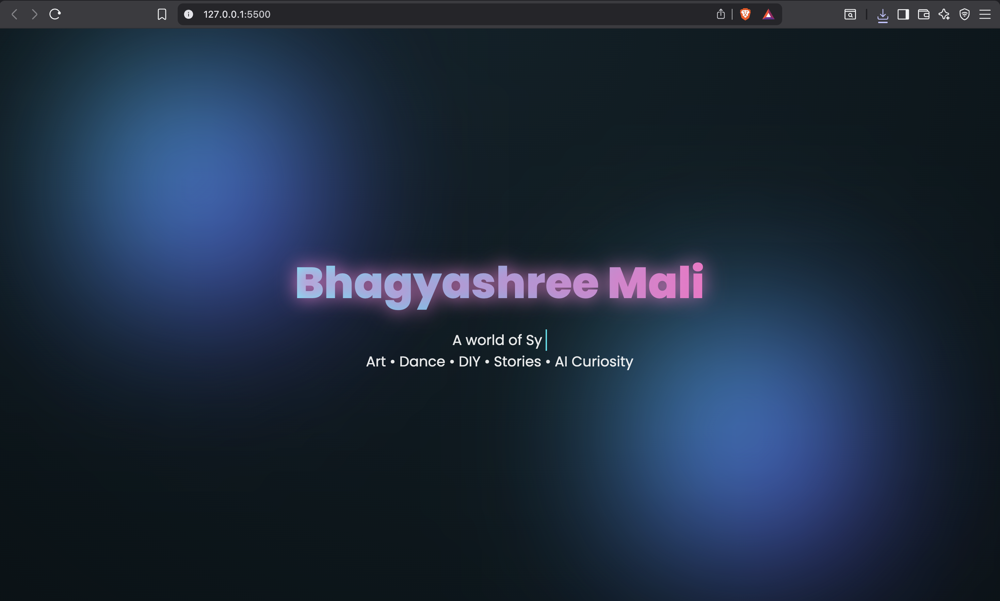
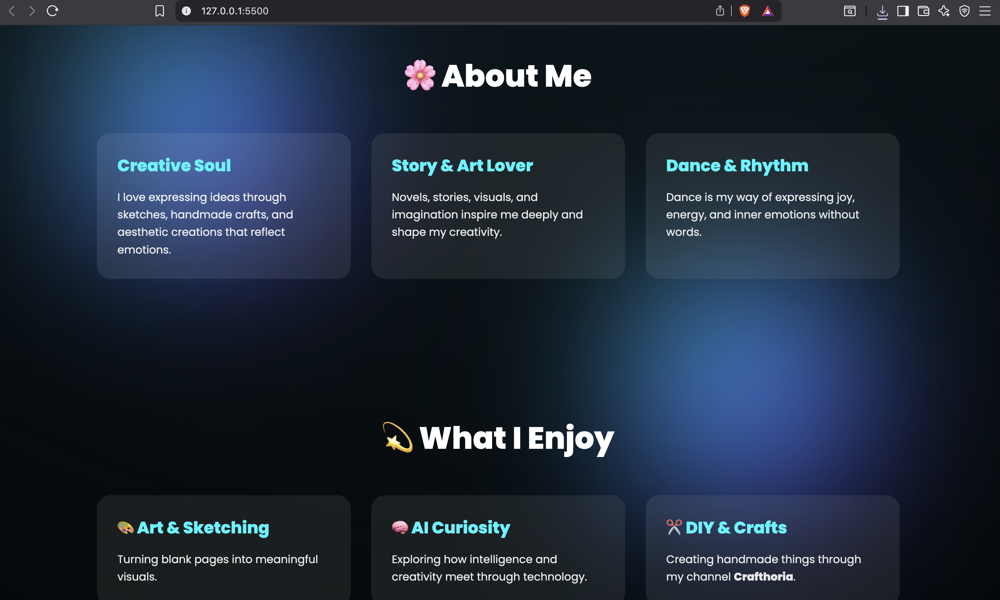
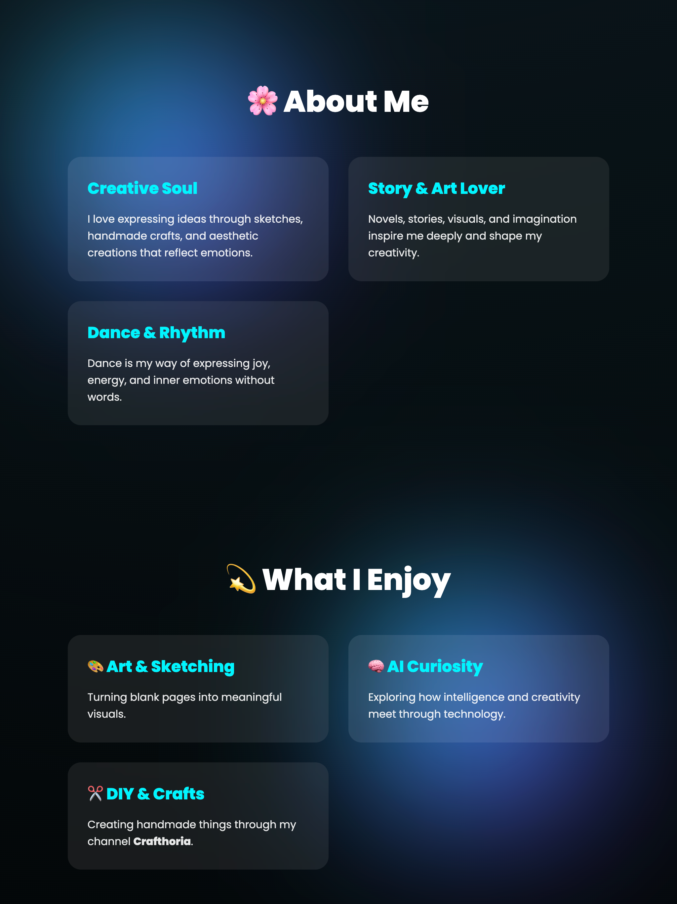
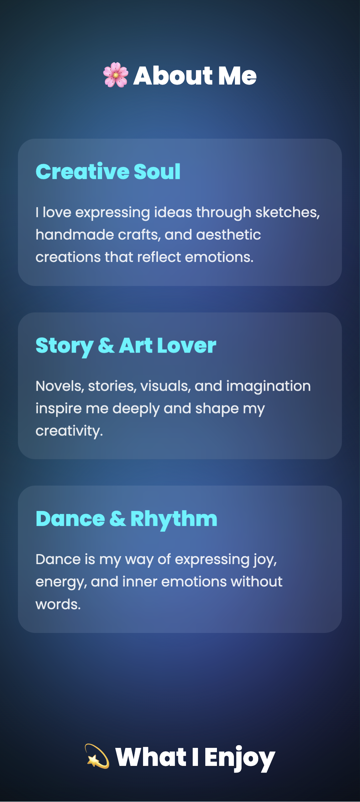

# ✨ Bhagyashree's Creative Universe 🌙

> "Creativity is not a skill. It's a way of seeing the world."

Welcome to my personal landing page — a digital space where **art, dance, curiosity, and code** converge. This project is a visual expression of my inner creative world, built to feel alive.

🔗 **Live Demo:** [bhagyashreemali.github.io/landing-page](https://bhagyashreemali.github.io/landing-page/)

---

## 📱 Responsive Previews

### 💻 Desktop View

|                Hero Section                 |                     Content Sections                     |
| :-----------------------------------------: | :------------------------------------------------------: |
|  |  |

### 📟 Tablet View (iPad Pro)

<p align="center">
  
</p>

### 📲 Mobile View

<p align="center">
  
</p>

---

## 🌈 The Experience

This page is designed with a **Dark, Dreamy & Modern** aesthetic, featuring:

- 🧊 **Glassmorphism UI** — Frosted cards with soft transparency
- 🌀 **3D Interactions** — Tilt-on-hover cards with immersive depth
- 🌠 **Animated Atmosphere** — Floating gradient orbs and glowing text
- ✍️ **Typewriter Effect** — Dynamic text that types itself out
- 📱 **Fully Responsive** — Optimized for desktop, tablet, and mobile

---

## 🎨 Inside the Universe

| Section                 | Description                                             |
| ----------------------- | ------------------------------------------------------- |
| 🌸 **About Me**         | A glimpse into my soul as a creator, artist, and dancer |
| 💫 **What I Enjoy**     | Art & Sketching, AI Curiosity, DIY & Crafts             |
| 🚀 **Passion Projects** | Image Caption Generator • Crafthoria • Divine Wisdom    |

---

## 🛠️ Built With

- **HTML5** & **CSS3** — 3D Transforms, Glassmorphism, Animations
- **Vanilla JavaScript** — Interaction & Motion
- **Google Fonts** — Poppins

> No frameworks. Just creativity and code. ✨

---

## � Project Structure

```
landing-page/
├── index.html
├── style.css
├── script.js
├── screenshorts/
│   ├── laptop1.png
│   ├── laptop2.png
│   ├── ipadpro.png
│   └── mobile.png
└── README.md
```

---

## 🚀 Getting Started

1. Clone the repository:
   ```bash
   git clone https://github.com/bhagyashreemali/landing-page.git
   ```
2. Open `index.html` in your browser — no build step needed!

---

## 🪄 Connect with Me

**Bhagyashree Mali** ✨  
Artist | Dancer | DIY Creator | AI Student

If this space inspired you, feel free to ⭐ the repository!

---

🤍 _Created with intention._
