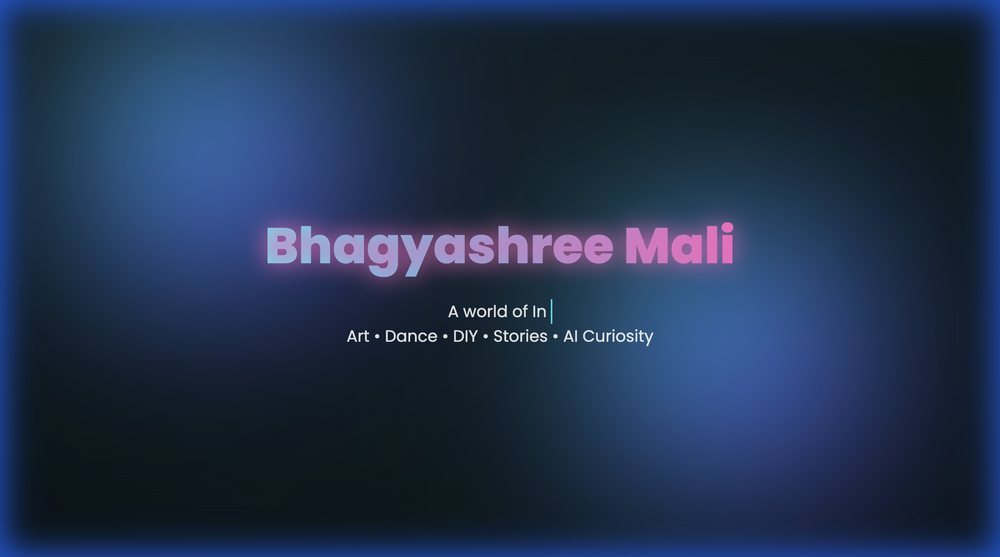
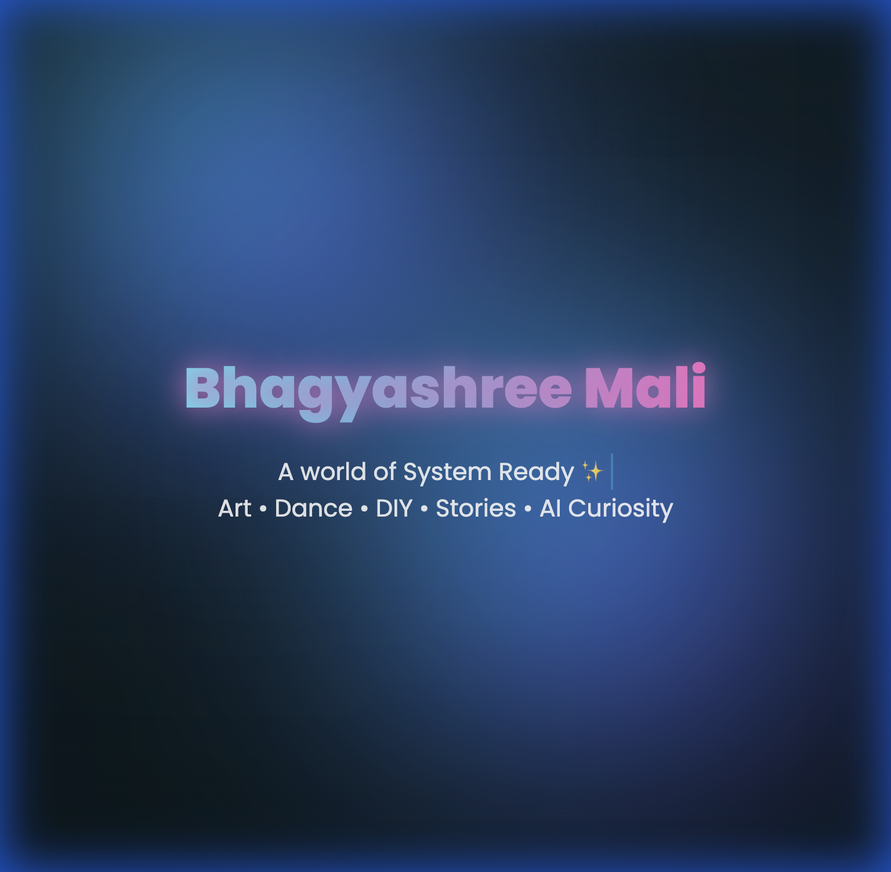
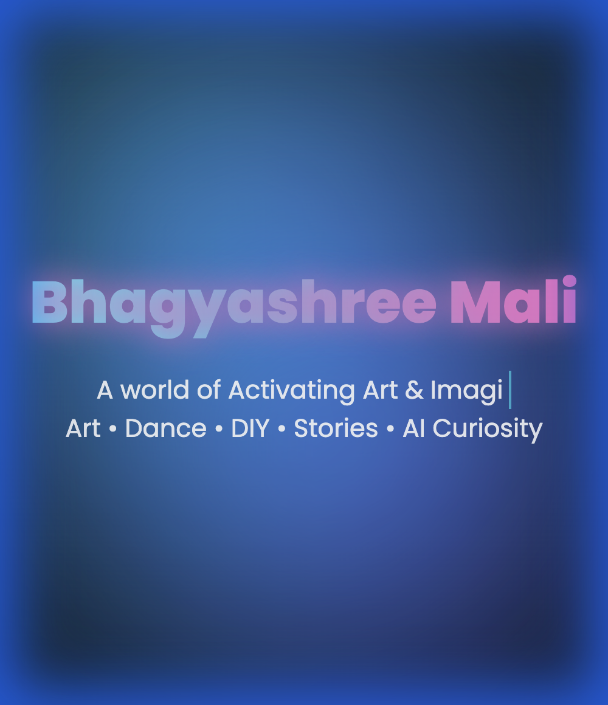

# ✨ Bhagyashree's Creative Universe 🌙

> "Creativity is not a skill. It’s a way of seeing the world."

Welcome to my personal landing page—a digital space where **art, dance, curiosity, and code** converge. This project is a visual expression of my inner creative world, built to feel alive.

---

## 📱 Responsive Previews

### 💻 Laptop View

### 📟 Tablet View

### 📲 Mobile View

---

## 🌈 The Experience

This page is designed with a **Dark, Dreamy & Modern** aesthetic, featuring:

- 🧊 **Glassmorphism UI**: Frosted cards and soft transparency.
- 🌀 **3D Interactions**: Tilt-on-hover cards and immersive depth.
- 🌠 **Animated Atmosphere**: Floating gradient orbs and glowing text.
- 📱 **Fully Responsive**: Optimized for all devices.

---

## 🎨 Inside the Universe

- **🌸 About Me**: A glimpse into my soul as a creator, artist, and dancer.
- **💫 What I Enjoy**: From sketching and DIY crafts to exploring the boundaries of AI.
- **🚀 Passion Projects**:
  - **Image Caption Generator**: Blending AI with human imagination.
  - **Crafthoria**: My creative outlet for handmade art.
  - **Divine Wisdom**: A space for positivity and reflection.

---

## 🛠️ Built With

- **HTML5** & **CSS3** (3D Transforms, Glassmorphism, Animations)
- **Vanilla JavaScript** (Interaction & Motion)
- **Google Fonts** (Poppins)

No frameworks. Just creativity and code.

---

## 🚀 Live Preview

Experience the universe live: [Live Demo](https://bhagyashreemali.github.io/landing-page/)

---

## 🪄 Connect with Me

**Bhagyashree Mali** ✨  
Artist | Dancer | DIY Creator | AI Student

If this space inspired you, feel free to 🌟 the repository!

---

🤍 _Created with intention._
